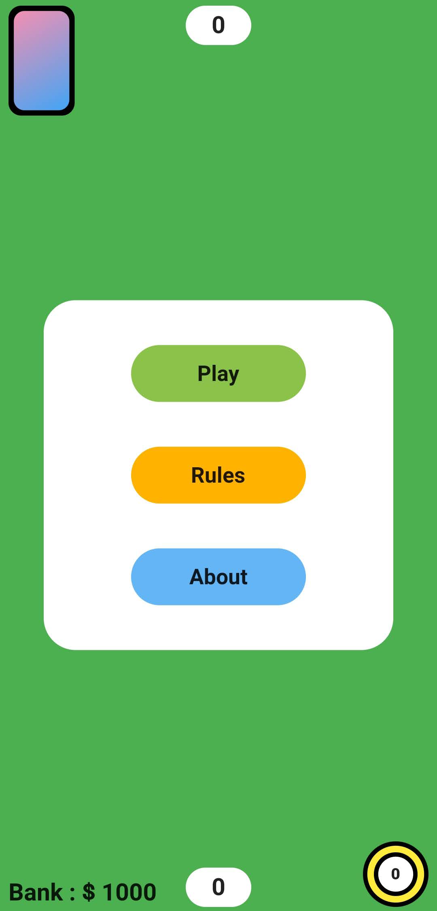
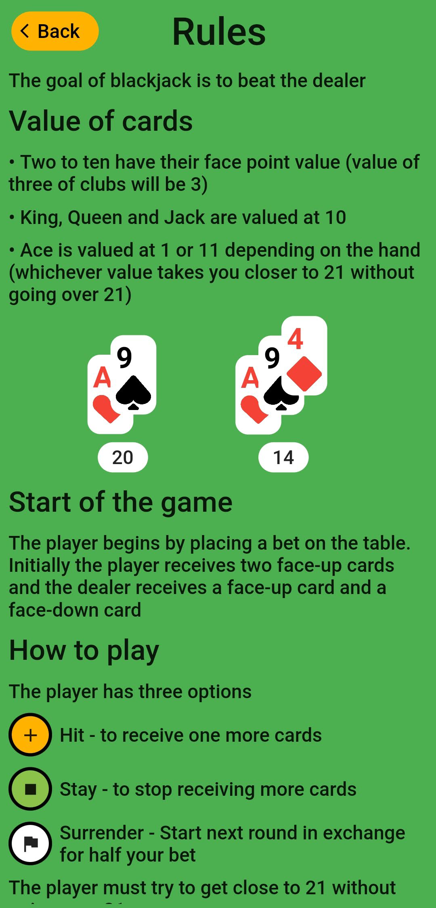
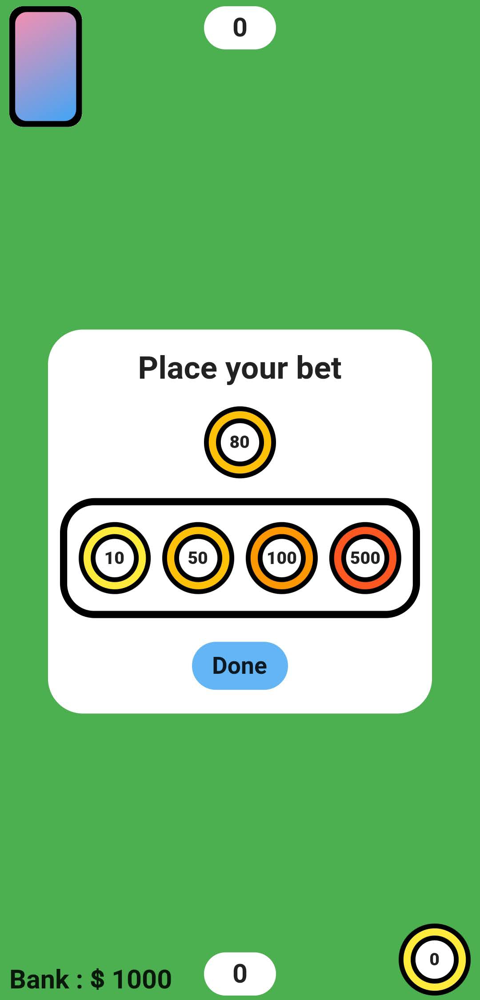
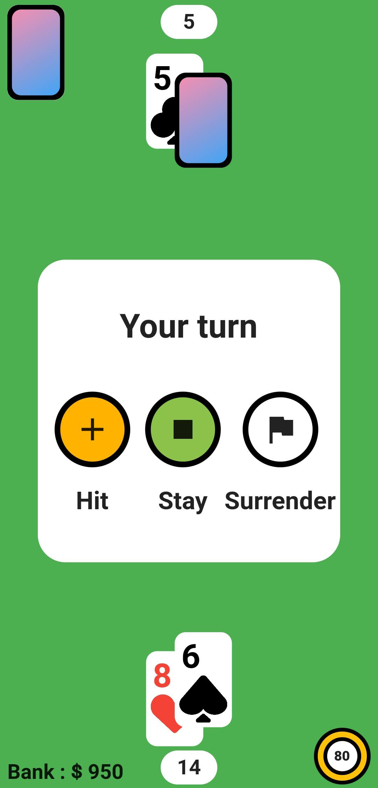
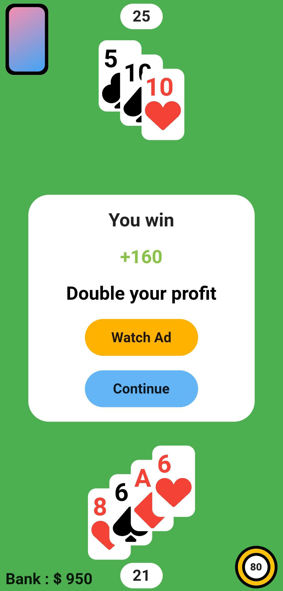
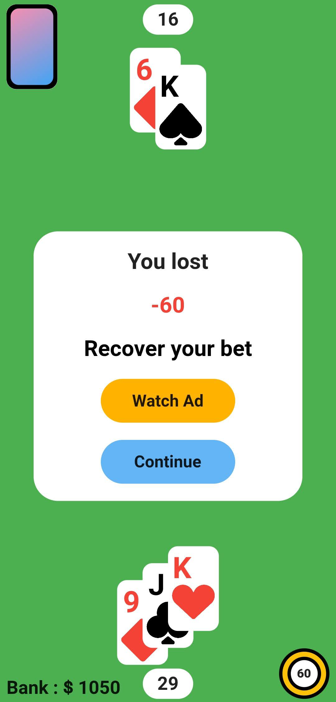

# Blackjack-Flutter
Minimal version of Blackjack in Flutter

The app uses **bloc** for state management and **google_mobile_ads SDK** to display ads

In game screenshots

               

The initial version of this app does not comply with Google's developer content policy
